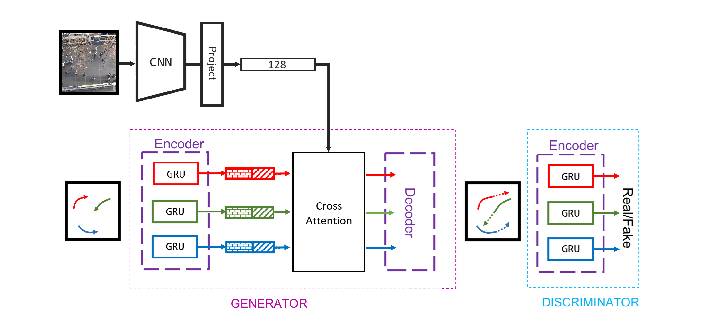

# DATA302: Term Project

## Report
[Trajectory Prediction in Autonomous Driving System](./assets/report.pdf)

## Model Overview

## Result
### Average Running Time

|      | SGAN   | GRU    | GRU-Pooling | GRU-Attention |
| ---- | ------ | ------ | ----------- | ----------- |
| Time | 47.44s | 50.01s | 59.64s      | 7.61s       |

### Performance (ADE/FDE)

|     | SGAN      | GRU         | GRU-Pooling | GRU-Attention |
| --- | --------- | ----------- | ----------- | ----------- |
| ETH | 4.11/7.52 | 26.38/59.86 | 2.08/3.84   | 1.62/2.85   |
| SDD | 3.85/6.96 | 18.84/42.99 | 1.18/2.24   | 0.77/1.38   |
