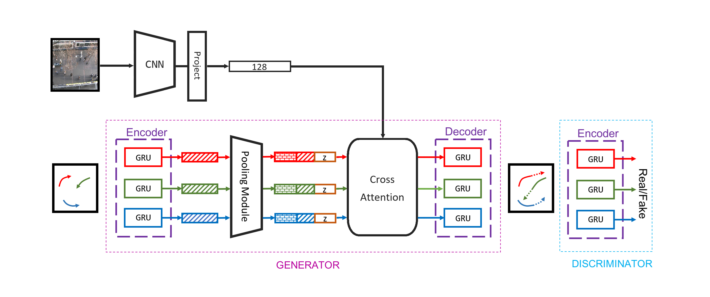
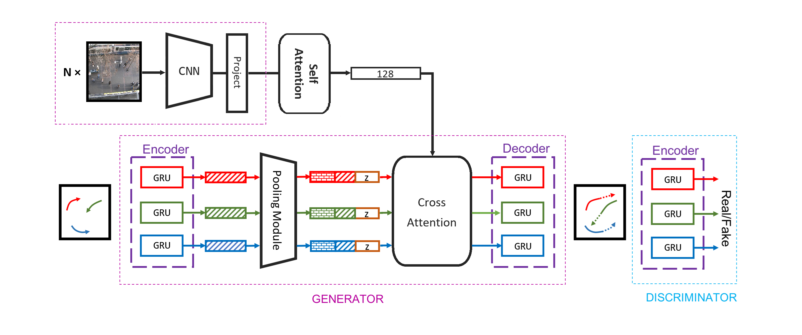

# Overview
## GRU Model

## GRU with Image Pool

## Average running time
- t=2000일 때 측정

|      | SGAN   | GRU    | GRU+CNN | GRU+CNN++ |
| ---- | ------ | ------ | ------- | --------- |
| Time | 47.44s | 50.01s | 59.64s  | 7.61s     |

## Performance (ADE/FDE)
- t=2000일 때 측정

|     | SGAN      | GRU         | GRU+CNN   | GRU+CNN++ | LOFTR     |
| --- | --------- | ----------- | --------- | --------- | --------- |
| ETH | 4.11/7.52 | 26.38/59.86 | 2.08/3.84 | 1.62/2.85 | 1.56/2.88 |
| SDD | 3.85/6.96 | 18.84/42.99 | 1.18/2.24 | 0.77/1.38 |           |